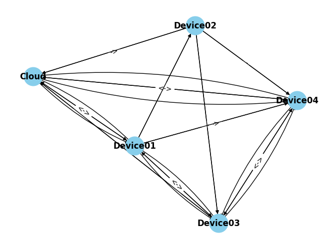
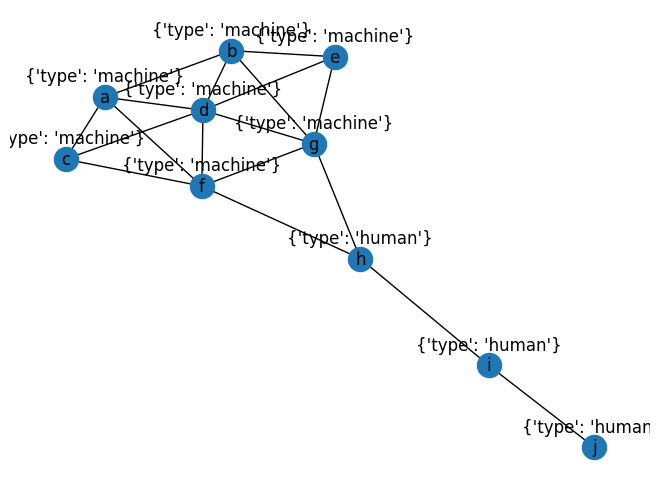

## Randomized Device Connections with Directions
### Description
Creates a directed graph using NetworkX and visualizes it with Matplotlib. It represents devices and their randomly generated connections, including uni-directional, bi-directional, and no connections.

### Features
Nodes representing devices: "Device1", "Device2", "Device3", and "Cloud".
Randomly generated connections with directions: uni-directional, bi-directional, or none.
Visualization of the graph with different arrow styles for each connection type.

## Graph of Machines and Humans
### Description
Creates an undirected graph using NetworkX and visualizes it with Matplotlib. It includes nodes representing machines and humans and edges representing their connections. The nodes are labeled with their type.

### Features
Nodes categorized as either 'machine' or 'human'.
Connections between nodes represented as edges.
Custom labels for nodes indicating their type.

